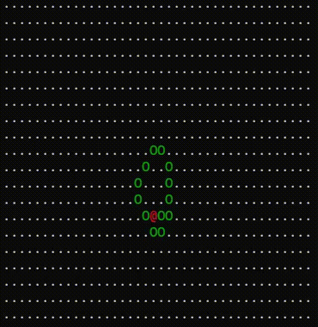

# Langton's Ant

Langton's Ant is a cellular automaton that simulates the behavior of an ant on a two-dimensional grid. Despite its simple rules, it generates complex and fascinating patterns.

## Rules

1. If the ant is on a **black** cell (`.`): paint the cell **green** (`o`), turn **right** and move forward.
2. If the ant is on a **green** cell (`o`): paint the cell **black** (`.`), turn **left** and move forward.

## Background
**Christopher Langton** is a pioneer in the field of **artificial life**. In 1986, while working at the Santa Fe Institute, he invented Langton's Ant as a simple yet powerful example of how deterministic systems with very basic rules can generate emergent behavior and complexity.

Langton's Ant is famous for its seemingly chaotic behavior that eventually converges into a repetitive pattern called the "highway". This discovery was fundamental in demonstrating that complexity can emerge from simplicity, a central concept in artificial life.

Langton is also known for coining the term **"artificial life"** and for directing the Artificial Life Conference, which has been held annually since 1987.

## License

[MIT](LICENSE) License.

